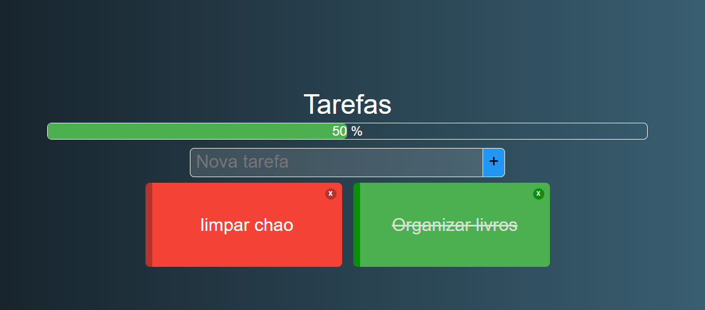
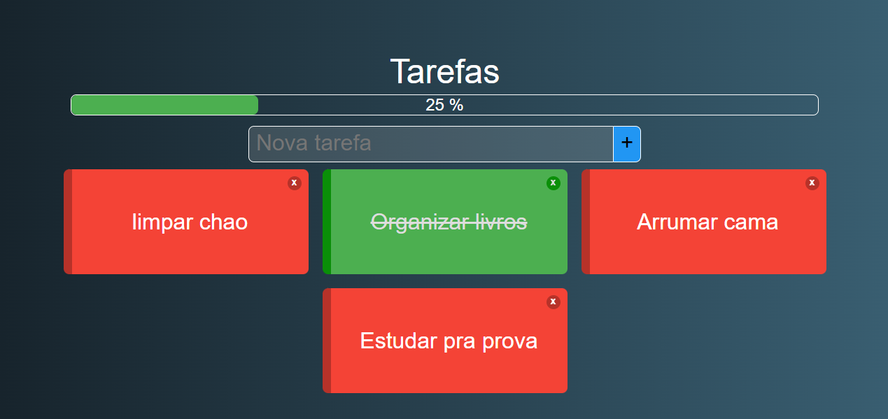

# Projeto To do Tasks

Projeto criado usando VUE.JS 2 onde o foco dele é fazer uma lista de tarefas interativa, onde pode ser 
alterado como "Feito" e " Pendente", nas cores Verde e Vermelho respectivamente. 
Funcionalidades do projeto: 
- Barra de progresso dinâmica com o numero de tarefas 
- Verificação de tarefas repetidas, caso seja necessário
- Uso de localStorage pra manter salvo as tarefas mesmo com a aba fechada.

## Exemplo da tela funcional

Exemplo de Tasks<br>
<br>
Exemplo da barra de progresso dinâmica
<br>

## Project setup
```
npm install
```

### Compiles and hot-reloads for development
```
npm run serve
```
